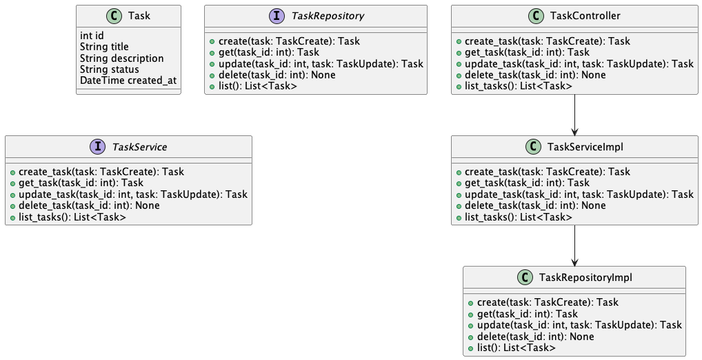

# Proposta de Atividade: Sistema de Gerenciamento de Tarefas

## Objetivo

Desenvolver um sistema de gerenciamento de tarefas utilizando FastAPI, aplicando os conceitos de controllers, services e
repositories.

## Descrição do Projeto

O projeto consiste em criar uma API para gerenciamento de tarefas que permite a criação, leitura, atualização e exclusão
de tarefas. Cada tarefa deve ter um título, descrição, status e data de criação.

## Estrutura do Projeto

Sugestão de estrutura de diretórios:

```
fastapi-task-management/
├── app/
│   ├── controllers/
│   │   └── task_controller.py
│   ├── services/
│   │   └── task_service.py
│   ├── repositories/
│   │   └── task_repository.py
│   ├── models/
│   │   └── task_model.py
│   ├── main.py
│   └── database.py
└── tests/
    ├── test_controllers.py
    ├── test_services.py
    └── test_repositories.py
```

### Descrição dos Componentes

- **Controllers**: Responsáveis por definir os endpoints da API.
- **Services**: Contêm a lógica de negócios e validações.
- **Repositories**: Gerenciam a interação com o banco de dados.

## Requisitos

- Python 3.10+
- FastAPI
- SQLAlchemy
- SQLite

## Tarefas

### 1. Modelagem de Dados

Crie um modelo para representar uma tarefa com os seguintes campos:

- `id` (integer, primary key)
- `title` (string)
- `description` (string)
- `status` (string, pode ser "Pendente", "Em Progresso", "Concluída")
- `created_at` (datetime)

### 2. Repositório de Tarefas

Implemente a camada de repositório para realizar operações CRUD:

- Criar uma nova tarefa
- Obter uma tarefa pelo ID
- Atualizar uma tarefa
- Deletar uma tarefa
- Listar todas as tarefas

### 3. Serviço de Tarefas

Implemente a camada de serviço para validar os dados e aplicar a lógica de negócios:

- Criar uma nova tarefa
- Obter uma tarefa pelo ID
- Atualizar uma tarefa
- Deletar uma tarefa
- Listar todas as tarefas

### 4. Controlador de Tarefas

Implemente os endpoints da API utilizando FastAPI:

- `POST /tasks/`: Criar uma nova tarefa.
- `GET /tasks/`: Listar todas as tarefas.
- `GET /tasks/{task_id}`: Obter detalhes de uma tarefa específica por ID.
- `PUT /tasks/{task_id}`: Atualizar uma tarefa específica por ID.
- `DELETE /tasks/{task_id}`: Deletar uma tarefa específica por ID.

### 5. Testes Unitários

Escreva testes unitários para os serviços e controladores da aplicação.

### DESAFIO (OPCIONAL)

### 6. RabbitMQ

Implemente um sistema de mensageria utilizando RabbitMQ para enviar uma mensagem toda vez que uma nova tarefa for criad
ou atualizada.

### Diagrama de Objetos

Implemente conforme o diagrama de objetos abaixo:



### Documentação OpenAPI

Defina a documentação da API utilizando OpenAPI com os endpoints e modelos necessários:

Exemplo no arquivo `openapi.yaml`
Para ver a interface grafica , copie o conteudo do arquivo `openapi.yaml` e cole no
site [Swagger Editor](https://editor.swagger.io/)

## Entrega

Submeta o projeto no GitHub e envie o link do repositório até a data estipulada.

## Avaliação

A avaliação será baseada nos seguintes critérios:

- Correta implementação dos endpoints
- Aplicação dos conceitos de services, repositories e controllers
- Organização do código e boas práticas
- Qualidade dos testes unitários
- Documentação da API utilizando OpenAPI

Boa sorte e bom trabalho!
